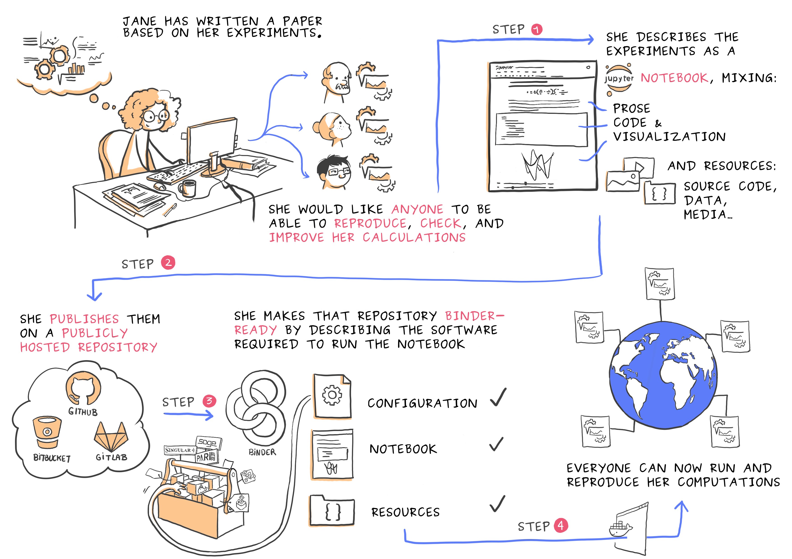

# Madpy Lightning Talk: Binder

From the [Binder documentation](https://mybinder.readthedocs.io/en/latest/index.html):

> Binder allows you to create custom computing environments that can be shared and used by many remote users. It is powered by BinderHub, which is an open-source tool that deploys the Binder service in the cloud. One-such deployment lives here, at mybinder.org, and is free to use.

## Reference links

- repo2docker: https://repo2docker.readthedocs.io
- binderhub: https://binderhub.readthedocs.io
- mybinder: https://mybinder.org/ 

## Interesting uses of binder

- [Scikit-learn examples](https://scikit-learn.org/stable/auto_examples/)
- [LIGO gravitational waves analysis](https://github.com/losc-tutorial/LOSC_Event_tutorial)
- [Running a bokeh server with Binder](https://github.com/binder-examples/bokeh)
- [VSCode in Jupyter](https://github.com/betatim/vscode-binder)
